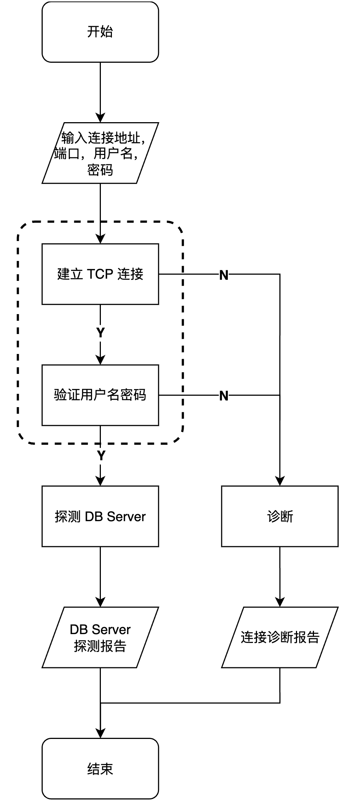

# redis-diagnose-tool
[](https://pypi.org/project/redis-diagnose-tool/)
[](./LICENSE)

[English](README.md) | 简体中文

`redis-diagnose-tool`是一个用于诊断 `Redis/Tair`客户端连接错误的工具，并且支持探测`Redis/Tair`实例内部 DB Server 的响应 rtt。

**该诊断工具仅适用于客户端连接阿里云的 Redis 和 Tair 实例**

**流程：**

1. 客户端尝试与 `Redis/Tair`实例建立 TCP 连接
2. 执行`AUTH` 命令校验用户名和密码，若未指定密码则执行 `PING`命令验证是否开启免密
3. 通过 `INFO`命令和阿里云 [proxy](https://help.aliyun.com/zh/tair/developer-reference/in-house-commands-for-tair-instances-in-proxy-mode?spm=a2c4g.11174283.0.0.6484137doOGYo5) 自研的`IINFO` 命令和 `RIINFO` 命令来探测实例内部 DB Server 的响应 rtt



## 安装

**通过 pip 安装，需要 Python 3.6或更高版本**

```bash
# 1. 从 pypi 源安装
pip install redis-diagnose-tool

# 2. 从源码安装
git clone https://github.com/tair-opensource/tair-tools.git
cd redis-diagnose-tool
pip install .
```

可执行程序 `diag`安装在python 解释器的 bin 目录下

通过 `pip show redis-diagnose-tool` 找到 redis-diagnose-tool包的安装路径，参数模版 `arguments.yaml`存放在安装路径下的diagnose 目录中

**通过yum 安装，需要阿里巴巴镜像源**

```bash
sudo yum install redis-diagnose-tool -b current
```

`/opt/redis-diagnose-tool-{version}`路径下会安装可执行程序 `diag` 和参数模版 `arguments.yaml` 

## 用法

该工具支持基础模式和高级模式。

基础模式只能检测客户端能否与`Redis/Tair`实例建立 TCP 连接，并给出连接失败的报错信息。

高级模式下能够通过`Redis/Tair`的[OpenAPI](https://help.aliyun.com/zh/tair/developer-reference/openapi-sdk?spm=a2c4g.11186623.0.0.42447a9eQX2LVu)获取实例的基础信息、网络信息、白名单等信息，如果客户端在 ECS 上也能通过 [ECS OpenAPI](https://help.aliyun.com/zh/ecs/developer-reference/api-reference-ecs/?spm=a2c4g.11186623.0.0.6ada2e55g69huQ) 获取 ECS 实例的信息。因此高级模式能够诊断出导致连接失败的具体问题，包括连接信息错误、在公网环境通过实例的内网地址连接实例、未正确配置白名单或实例安全组、ECS安全组拦截等。

基础模式和高级模式均支持校验用户密码以及探测实例内部 DB Server的响应情况。

**参数说明：**

```
Redis diagnose tool configuration

optional arguments:
  --help                        Help information
  -c CONFIG, --config CONFIG    Configuration file path (YAML format). If the configuration file is specified, the command arguments won't work.

Tool options:
  -A, --advanced                   Enable advanced mode, default off
  -d, --detect_server              Detect server, default off
  -l {zh,en}, --language {zh,en}   Language, zh for Chinese and en for English, default zh

Redis instance connection information:
  -h HOST, --host HOST                Connection hostname
  -p PORT, --port PORT                Connection port, default 6379
  -t TIMEOUT, --timeout TIMEOUT       Connection timeout, second, default 2s
  -u USER, --user USER                Username
  -a PASSWORD, --password PASSWORD    Password

Redis instance information:
  Following arguments should be specified in advanced mode. You only need to specify one of redis_region_id and redis_endpoint.

  -r REDIS, --redis REDIS                                  Redis instance id
  -g REDIS_REGION_ID, --redis_region_id REDIS_REGION_ID    Redis instance region id
  -o REDIS_ENDPOINT, --redis_endpoint REDIS_ENDPOINT       Redis instance endpoint

ECS instance information:
  Following arguments should be specified in advanced mode if the client is on ECS. You only need to specify one of ecs_region_id and ecs_endpoint.

  -e ECS, --ecs ECS                                  ECS instance id
  -G ECS_REGION_ID, --ecs_region_id ECS_REGION_ID    ECS instance region id
  -O ECS_ENDPOINT, --ecs_endpoint ECS_ENDPOINT       ECS instance endpoint

SDK information:
  Following arguments should be specified in advanced mode.

  -k AK, --ak AK        Access key id
  -s SK, --sk SK        Access key secret
```

**使用样例：**

```bash
# 1. 通过 pip 安装，bin 目录添加到环境变量中时可直接运行 diag
diag --help

# 2. 通过 yum 安装
cd /opt/redis-diagnose-tool-{version}
./diag --help
```

基础模式下运行

```bash
diag -h "connection_address" -p 6379 -u "user" -a "password"
```

高级模式下运行

```bash
diag -h "connection_address" -p 6379 -u "user" -a "password" -k "ak" -s "sk" -r "redis_instance_id" -g "redis_region_id" -A
```

使用参数模版`arguments.yaml`

高级模式下需要在命令行中设置多种可选参数，繁琐且容易出错，所以提供一个参数模版
```bash
diag --config "arguments.yaml"
```

若使用了参数模版，命令行参数就无效

## 日志说明

- diagnose.log: 诊断日志，记录诊断流程、详细的连接诊断报告和 DB Server 的诊断报告

- sdk.log: 记录Open API的 调用日志，包括接口、返回值、报错
- error.log: 记录程序运行时的异常信息和异常抛出链路

## 使用许可

[MIT](LICENSE)
